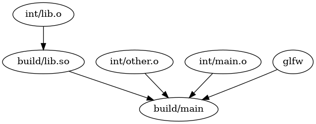

# rubuild
Build c projects with gcc using a Ruby script.

## Usage
1. Import rubuild module
```ruby
#!usr/bin/ruby
require 'rubuild'
$LOAD_PATH << '.' # rubuild.rb location
```
2. Create targets
```ruby
#                                  v Target name                               v Intermediates directory 
main = Rubuild::create_executable('main', './build/').add_sources(['main.c'], './int/')
#                                          ^ Output directory       ^ Source files 
```
3. Add dependncies
```ruby
main.add_dependency(lib)
```

4. Build target
```ruby
Rubuild::build_target(main)
```

## Run example:

```console
cd example/
chmod +x ./example.sh
./example.sh
```

## Visualize dependency graph
Using method `Rubuild::output_dot_file(target_name, output_path)`, a .dot file can be generated to visualize dependencies in the project with Graphviz.
### Example:
